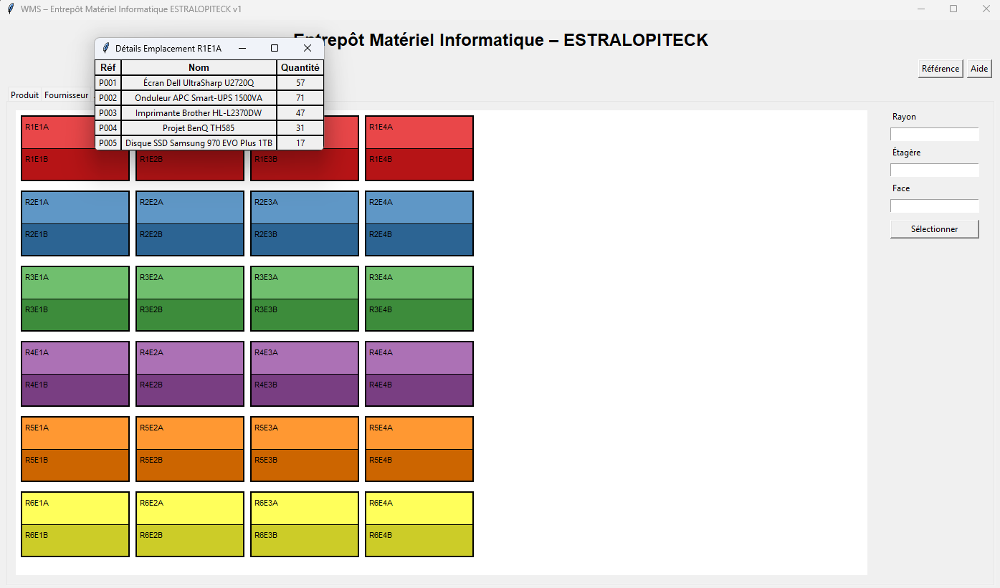

# WMS – Gestion d’Emplacements (v2 Finale)

**Version :** 2.0
**Date :** 29 juillet 2025

## Description

Cette deuxième version de l’interface graphique WMS (Warehouse Management System) développée en Python/Tkinter est optimisée pour la gestion de matériel informatique et propose :

* **Vue Emplacement repensée** : 2 faces (A et B) par rack, codes `R<rayon>E<étagère><face>` (ex. `R1E1A`), couleurs distinctes par rayon.
* **Mini-tableau interactif** : un clic sur une case ouvre une fenêtre détaillant jusqu’à 5 produits (Réf, Nom, Quantité).
* **Chargement CSV dynamique** : importer n’importe quel fichier CSV via l’onglet Outils sans renommer.
* **Modules essentiels** : Produits, Fournisseurs, Journal, Inventaire, Étiquettes, Outils.
* **Formulaire Emplacement** : saisie de Rayon, Étagère, Face avec validation.

## Installation

1. Cloner le dépôt :

   ```bash
   git clone https://github.com/votre-organisation/wms-emplacement.git
   cd wms-emplacement
   ```
2. (Optionnel) Créer un environnement virtuel Python 3 :

   ```bash
   python3 -m venv venv
   source venv/bin/activate   # Linux/macOS
   venv\Scripts\activate    # Windows
   ```
3. Installer les dépendances (le cas échéant) :

   ```bash
   pip install -r requirements.txt
   ```

## Usage

```bash
python main.py
```

* Naviguer entre les onglets en haut (Produit, Fournisseur, Journal, Inventaire, Étiquettes, Emplacement, Outils).
* **Onglet Emplacement** : explorer la grille, cliquer sur une case pour afficher le mini-tableau.
* **Onglet Outils** : importer/exporter un inventaire CSV.

## Format CSV

Le fichier doit contenir :

* **Réf** : code produit (ex. `P001`).
* **Nom** : nom complet du matériel (ex. `Serveur Dell PowerEdge R740`).
* **Quantité** : nombre en stock.
* **Emplacement** : code rack (ex. `R2E3A`).

Exemple :

```csv
Réf,Nom,Quantité,Emplacement
P001,Serveur Dell PowerEdge R740,10,R1E1A
P002,Switch Cisco Catalyst 2960,5,R1E1B
```

## Roadmap v3

* Intégration base de données (SQLite, PostgreSQL).
* Recherche/tri personnalisés.
* Impression rapports PDF/Excel.
* Alertes de stock et notifications.
* Thèmes et internationalisation (i18n).

---

*Interface fournie « as-is ». Libre d’usage et de modification selon vos besoins.*
